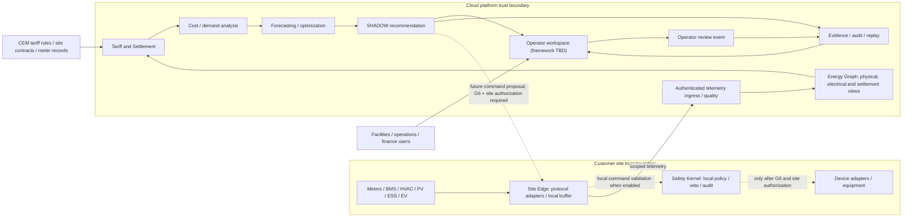
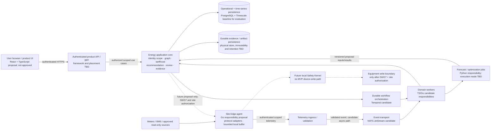

# Logical Architecture Design Baseline

**Status:** Logical boundaries are research-derived draft proposals; product-owner approval is pending. Cloud-core technology remains under G6.9-R2 evaluation. No production framework or runtime is approved by this document.  
**Authority:** G6.8 enterprise deployment and safety boundaries, G6.9-R2 Consolidation Gate, Library v1.6.2, and current handoff.  
**Purpose:** Explain system responsibilities and data/control flow without turning a candidate stack into a production decision.

## Product and operating boundary

```text
Commercial building / site
  Meters · BMS · HVAC/chillers · PV · ESS · EV · other flexible loads
                         |
             site protocols / adapters
                         |
          Go Edge Energy Runtime + Safety Kernel
             local buffering · validation · audit
                         |
              authenticated secure channel
                         |
Cloud Intelligence Plane
  ingestion → Energy Graph → tariff/settlement → analytics
      → forecast/optimization → recommendation/evidence
                         |
             operator review / approval
                         |
       authorized command proposal (only after gates)
                         |
      Edge policy + safety validation → device adapter
```

Cloud analysis and optimization do not directly write to equipment. Edge is the site execution boundary; the Safety Kernel may reject any proposal. Initial product operation is SHADOW/advisory.

## System context and trust boundaries

The following is a logical view for product and architecture review. Boxes are responsibility boundaries, not a mandated microservice or deployment topology. The cloud framework, service decomposition and production runtime remain open under G6.9-R2.



Solid paths show the initial telemetry, analysis, SHADOW and evidence loop. Dashed paths show a possible future command route only; the MVP has no device-write affordance, and a cloud proposal never bypasses the site Edge or Safety Kernel. The diagram does not imply that a particular external contract, tariff source or site connection is already integrated.

## Domain responsibilities

- **Telemetry and provenance:** preserve source, site/tenant, event time, ingestion time, quality, and mapping status.
- **Energy Graph:** keep physical/electrical topology separate from settlement topology; link assets and meters to contracts and tariff versions without making assets own prices.
- **Tariff/Settlement Engine:** resolve meter → contract → tariff version using effective dates and explicit evidence; calculate only when required inputs are known; retain calculation trace and rule version.
- **Cost and demand analysis:** explain bill components and exposure using settled quantities and explicit uncertainty.
- **Forecasting and optimization:** consume versioned, quality-qualified domain data and return proposals with assumptions, constraints, baseline, and expected effect.
- **Evidence and replay:** persist inputs, versions, trace, outputs, and acknowledgements so the result can be deterministically replayed and measured.
- **Command arbitration and Safety Kernel:** separate proposal from authorization and execution; enforce tenant/site scope, freshness, limits, identity, replay protection, audit, and manual/offline behavior.

## Technology authority and decision state

| Layer | Current authority state |
|---|---|
| Product UI | React + TypeScript appeared in the provisional architecture; framework and frontend implementation choice require product-owner review and are not approved. |
| Application core | TypeScript/Go hybrid responsibilities are under evaluation; do not collapse this into a final framework choice. |
| Workflow | Temporal is a candidate; framework-native behavior is part of G6.9-R2 Step 3D. |
| Persistence | PostgreSQL + Timescale is the baseline for evaluation. |
| Eventing | NATS JetStream is a candidate. |
| AI / optimization / forecasting / simulation | Python responsibility. |
| Site Edge and safety-critical execution | Go responsibility. |
| Future plugin isolation | Wasm/WASI direction; outside the first MVP. |
| Cloud-core candidates | A, B, and C+ remain in bake-off. C+ is provisional default, not winner. |
| Existing Node/NestJS code | Candidate B implementation path; not a stack-selection result. |
| Java tariff implementation | D-030 semantic tariff architecture remains relevant; Java/Spring implementation authority is suspended by D-069 pending bake-off or a separately approved boundary. |
| Next.js | Not an approved architecture decision. |

See `docs/03-architecture/technology-authority/` and the G6.9-R2 bake-off Authority for exact candidate topology and decision rules.

## Principal data and control flow

1. Receive telemetry with tenant/site identity, source timestamps, quality, and provenance.
2. Resolve records against the Energy Graph; reject cross-tenant or unmapped data rather than guessing.
3. Resolve applicable contract and tariff version for the meter and time interval. Unknown or conflicting tariff inputs fail closed.
4. Produce cost analysis and forecasts with source coverage and uncertainty.
5. Generate shadow recommendations from a versioned optimizer and compare to an explicit baseline.
6. Store an Evidence Record and deterministic replay inputs.
7. If a later gate authorizes control, convert a proposal into a scoped command; Edge revalidates freshness, identity, policy, and local safety before any device write.
8. Record acknowledgement and physical effect separately; retries must not create duplicate physical writes.

## Logical runtime view for review

This view makes runtime responsibilities and trust boundaries concrete enough for product-owner and engineering review. It describes logical runtime groups, not a one-process-per-box mandate. Candidate A/B/C+ may group the cloud responsibilities differently; deployment, provider, region and shared/dedicated/private mode remain open.



The browser is untrusted; API authentication does not itself establish a tenant/site grant. The application core must enforce scope in synchronous requests and in persisted/queued work. Event-bus payload fields do not establish producer identity. Evidence writes must be durable before the system reports a completed material result; the physical persistence mechanism and retention remain undecided.

| Logical runtime group | Responsibility / proposed boundary | Deployment decision still open |
|---|---|---|
| Browser experience | Present onboarding, evidence, cost-analysis and SHADOW review workflows; no direct device authority. React + TypeScript is a proposal only. | Framework, hosting, localization, supported browsers and responsive/accessibility acceptance after owner and user review. |
| Product API and application core | Authenticate, resolve authorization context and execute scoped product use cases. Preserve domain boundaries for Energy Graph, settlement, cost, recommendation and evidence. | Candidate A/B/C+ determines framework/process grouping after Step 3D/4; do not turn every module into a service by default. |
| Telemetry ingress and async transport | Authenticate producer identity, validate source/site/point binding and persist accepted/rejected raw evidence before downstream processing. Broker decouples ingest only if measured workloads/failure needs support it. | NATS JetStream is a candidate, not a requirement; transport, acknowledgement and replay semantics depend on connector and Step 3D evidence. |
| Workflow and domain workers | Run long-lived/retried business workflows with explicit state, idempotency and tenant/site scope. | Temporal is a candidate; runner persistence is still a Step 3D owner decision. Worker language/process placement follows candidate evidence. |
| AI/forecast/optimization jobs | Produce versioned, bounded SHADOW proposals with assumptions, constraints, uncertainty and evidence refs; no authority to change tariff truth or invoke field writes. | Python is the proposed responsibility boundary; model/solver/provider, isolation and execution mode remain open. |
| Persistence and evidence | Keep operational/series data distinct from immutable or append-only evidence semantics; preserve versioned lineage and tenant scope. | PostgreSQL + Timescale is the evaluation baseline; evidence object store, canonical digest, retention, region, backup and deployment mode remain open. |
| Site Edge | Authenticate and scope telemetry, buffer only under approved policy, report source/device health. In the MVP it has no device-write path. | Go is the responsibility proposal; target hardware, protocols, local store, update/support model and key custody require site/security evidence. |
| Safety Kernel and device adapter | Future local veto, limits, manual/offline behavior and command replay protection; separate proposal from acknowledgement and measured physical effect. | Outside current MVP; command authority, hardware/key design and every field integration require G6/G7 closure and explicit site/customer authorization. |

### Runtime review boundary

Review this view as responsibilities and trust boundaries. The owner may revise the product/authority boundary. Do not approve production containers, provider, region, HA topology, datastore split, protocol, cryptographic mechanism or microservice count from this diagram. Those need the selected product scope, G6.9-R2 evidence, deployment context, security review and operational targets.

## Macau-specific settlement constraint

Grid-connected PV export and the generator's feed-in settlement must be represented independently from another building customer's retail meter and bill. The amended public electricity-supply concession contract effective 2026-01-01 contemplates distribution of privately generated electricity only within the same concession/private land parcel and with prior written SAR authorization; model this only as a distinct, explicitly authorized physical distribution relationship. It does not establish cross-parcel allocation or retail bill credit. Do not allocate remote PV generation as customer bill credit unless the applicable contract, regulatory permission, meter topology, and CEM settlement evidence establish that right. U-025 remains open.

## Deployment and trust boundaries

- Model tenant and organization hierarchy explicitly; enforce isolation in APIs, events, storage, workflows, and Edge identity.
- Treat cloud-to-site messages as authenticated, scoped, versioned, expiring, and replay-protected.
- Make Edge behavior safe during cloud/broker outage; buffer telemetry where allowed and reject unsafe or stale commands.
- Preserve immutable audit/evidence needed to explain tariff results and command outcomes.
- Keep service/module boundaries aligned with domain and failure boundaries; do not require each logical module to become a separate microservice.
- Shared, Dedicated, and Private deployment modes are product/operations options from G6.8; their isolation, upgrade, and support costs require explicit engineering decisions.

## Security threat model

The stack-neutral STRIDE threat register, assets, trust boundaries, architecture invariants and required verification scenarios are in `docs/03-architecture/detailed-design/SECURITY-THREAT-MODEL-v0.1.md`. It is a review draft; threat likelihood/impact scoring, owner risk acceptance, deployment-specific controls and G6 closure evidence remain outstanding.

## Architecture decisions still open

1. G6.9-R2 Step 3D pinned integrations and fault-injection results.
2. Step 4 candidate decision under the bake-off hard gates and published decision rule.
3. G1 real bill/measurement evidence that finalizes bill-grade tariff semantics.
4. G2/G3 evidence that fixes in-scope asset and Energy Graph semantics.
5. G7.2 live R0 baseline/no-op and U-017 response/rebound evidence before field-control claims.
6. Product deployment and commercial model after segment and pilot discovery.

Any implementation proposal must identify which of these decisions it depends on and remain replaceable where the authority is still provisional.
